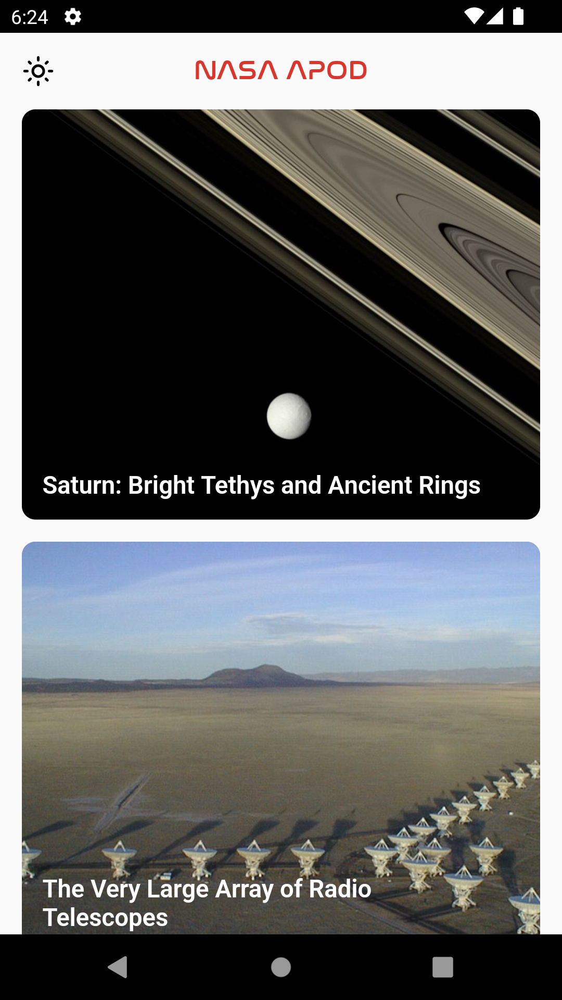
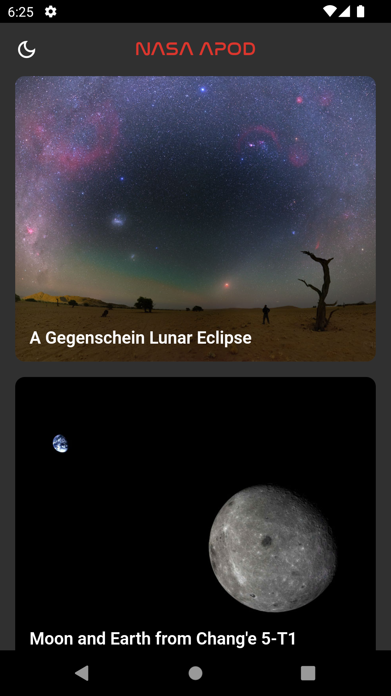
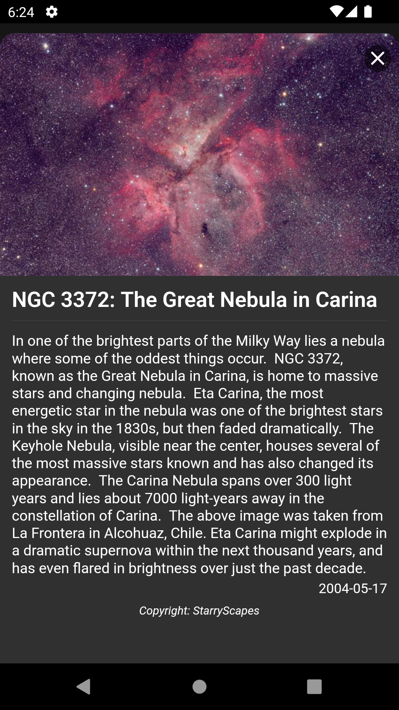
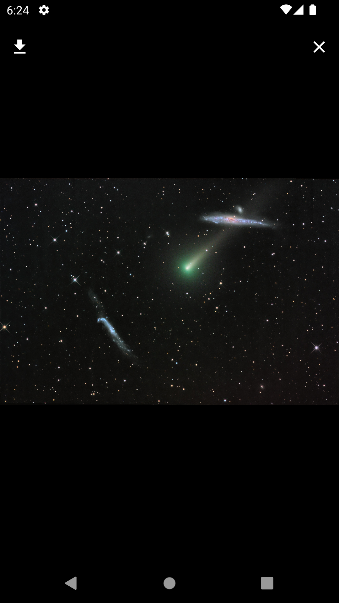

# Nasa APOD

NASA APOD shows randomly selected images from NASA Astronomical Pictures of the Day.

## Feautures

- Infinite scrolling
- Light and Dark Theme
- Show details of the APOD
- Show the picture in full screen
- Zoom the picture in full screen to see the details
- Save the picture to gallery

## Screenshots

## Getting Started

You can build and run the app without any configuration but you will have api limitations. You need to have an **Api Key** to avoid limitations. 
You can generate an **Api Key** from [NASA API](https://api.nasa.gov/). Then you generated an api key, you have to specify it to `_apodApi` in `ApodService` in `lib/api/nasa_apod_service.dart` file.

 

Enjoy the app!